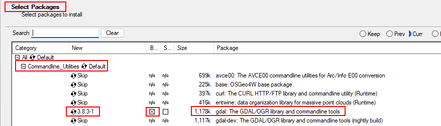

# Spring Boot and PostGIS tutorial

This project demonstrate how you can use PostGIS and Spring Boot to manage spatial data

The project consists of 3 parts:
- Cities - load from JSON and query;
- SpatialLab - initial startup method ... inserts all possible geometries

## Run PostGIS
Take care: we take post 5433 iso 5432 !!!!
```
See kubernetes postgis.yaml.
$ kubectl apply -f postgis.yaml
```
Connect with DBeaver to the database 'localhost', postgis with u/p postgis/postgis. 

## Install ogr2ogr
Steps to install the ogr2ogr CLI: 
- Check this video: https://www.youtube.com/watch?v=CDN9MRuuf9k.
- Go to https://trac.osgeo.org/osgeo4w/ and then download "OSGeo4W network installer".
- Select only the command line tools, see this picture:
  
- Check de installatie: open a command executor. $ ogrinfo
- If you get a GDAL missing, add to your system path: c:\OSgeo4W64\bin. 

## Load the City Data 

```
ogr2ogr -f "PostgreSQL" PG:"dbname=postgis user=postgis host=localhost port=5433 password=postgis" "src/main/resources/us_cities.geojson" -sql "select cast(ID as INTEGER), ELEV_IN_FT, POP_2010, STATE from us_cities" -nln us_cities
```

### Buid the applicaion
```
mvn clean install
```

### Run the application
```
mvn spring-boot:run
```


### Test the REST API

Open your browser at <http://localhost:8980/cities2/48.232509500000106/-101.29627319999997/200000>


- 1st parameter: latitude in degree
- 2nd parameter: longitude in degree
- 3rd parameter: distance in meter


This will return all the cities within the distance around the specified location.


### Access the database

```
psql -h localhost -p 5435 -d postgis -U postgis
```

## Part 3: Insert with dynamic insert statement
- Base info: https://www.concretepage.com/spring/spring-jdbctemplate-queryforlist
- Insert via sql-statements. See the InitialLabService ... insertArcs!

## Spring Boot 3 - works!
- No difference with WKB unknown type 8
